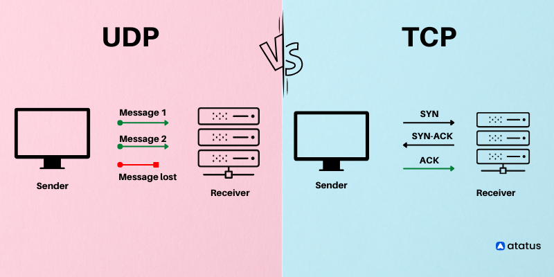

# Distributed System

A distributed system is a network of computers that work together to perform a task, such as processing data or running an application. In a distributed system, each computer or device ie network has its own processing capabilities and can work independently, but they also communicate with each other to coordinate their efforts and share resources.

# UDP Protocol

The User Datagram Protocol (UDP) is a connectionless protocol that is used to transmit data across networks. It is a low-overhead protocol that is suitable for transmitting data at high speeds, but it does not provide the reliability and error checking of other protocols such as TCP.

In a distributed system, UDP can be used to transmit data between nodes in the network. Because it is a connectionless protocol, it does not establish a dedicated connection between the sender and receiver before transmitting data. Instead, the sender simply sends the data and the receiver receives it, without any handshaking or other setup. This makes UDP suitable for applications that need to transmit large amounts of data quickly, but do not require the reliability or error checking of TCP.

One example of where UDP is used in distributed systems is in real-time applications, such as online gaming or video conferencing. These applications need to transmit data quickly and can tolerate some loss of data, so UDP is a good choice.

[www.atatus.com]((https://www.atatus.com/blog/what-is-udp/))

## Project Details

This project was done in distributed software course at LAB University. The main goal was to create two distributed applications (server and client) that can be used to send messages and simple files from a client to a server using UDP protocol. The message and the file name can be a string in the command line. the first command line parameter is the port that the server listens to and the second parameter is the port that the client connects to and the third one for the server address. the name of the file will transfer to the server too.